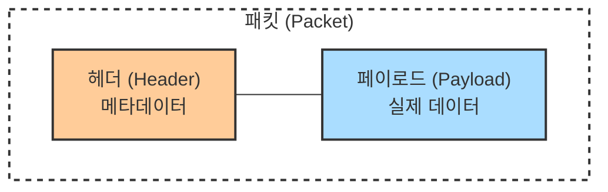
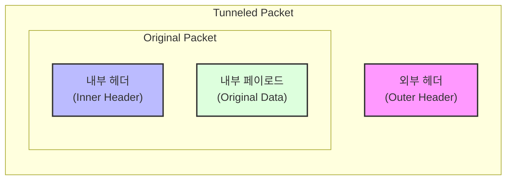
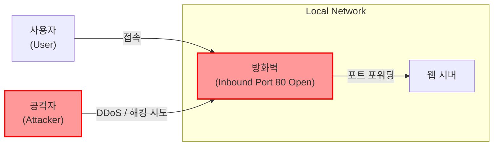
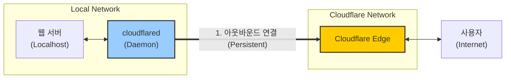
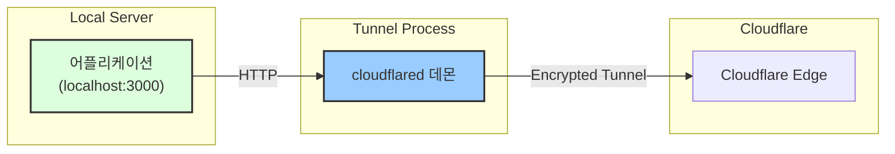
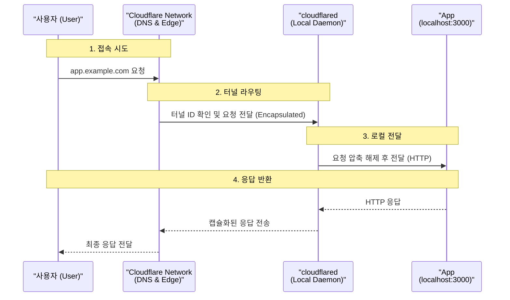
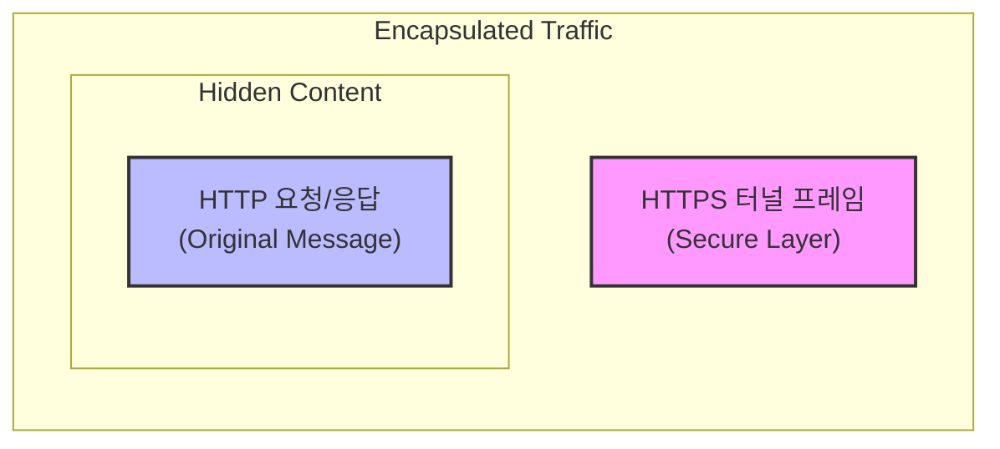
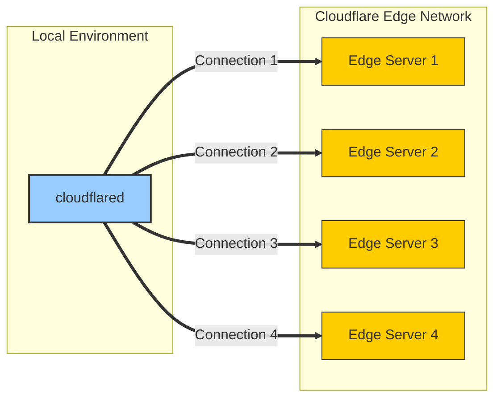

<br>{: .align-center}<br>


<br>

# 네트워크 터널링 : Cloudflare Tunnel로 로컬 환경을 안전하게 외부로 연결하기

## 들어가며

최근 로컬 개발 환경을 외부에서 접근할 수 있도록 하는 과정에서 Cloudflare Tunnel을 사용하게 되었습니다. 공유기의 복잡한 포트 포워딩 설정도 필요 없고, 공인 IP도 필요 없이 단 몇 분 만에 로컬 서버를 인터넷에 노출시킬 수 있다는 점이 매우 인상적이었습니다. 하지만 더 흥미로운 것은 이를 가능하게 하는 **터널링(Tunneling)** 기술이었습니다.

이 글에서는 네트워크 터널링의 기본 개념부터 시작해서, Cloudflare Tunnel이 어떻게 작동하는지 그 기술적 원리를 파헤쳐 보겠습니다.

---

## 네트워크 터널링이란?

### 물리적 터널의 비유

터널링을 이해하기 위해 먼저 물리적 세계의 터널을 생각해 봅시다. 산이나 강처럼 가로지르기 어려운 지형이 있을 때, 우리는 터널을 뚫어 직접적인 경로를 만듭니다. 네트워크 터널링도 이와 유사한 개념입니다.

네트워크에서 터널링은 **한 네트워크에서 다른 네트워크로 데이터를 전송하기 위해, 중간에 있는 네트워크를 "통과"하는 가상의 통로를 만드는 기술**입니다. 특히 중간 네트워크가 우리가 사용하는 프로토콜을 지원하지 않거나, 보안상의 이유로 직접 통신할 수 없을 때 유용합니다.

### 패킷 캡슐화: 터널링의 핵심 메커니즘

터널링의 핵심은 **캡슐화(Encapsulation)** 입니다. 이는 마치 편지를 봉투에 넣는 것과 같습니다.

네트워크를 통해 이동하는 데이터는 **패킷(Packet)** 이라는 작은 단위로 나뉩니다. 일반적인 패킷의 구조는 다음과 같습니다



- **헤더(Header)**: 목적지 주소, 사용 프로토콜 등의 메타데이터
- **페이로드(Payload)**: 실제 전송할 데이터

캡슐화된 패킷은 **패킷 안에 패킷이 들어있는 구조**입니다



이렇게 하면 원본 패킷을 보호하면서도, 중간 네트워크가 이해할 수 있는 형태로 데이터를 전송할 수 있습니다.

### 터널링이 필요한 이유

#### 1. **프로토콜 호환성 문제 해결**

예를 들어, 회사 본사(A지점)와 지사(B지점)가 최신 IPv6 프로토콜을 사용하는데, 중간에 있는 인터넷 서비스 제공자(ISP)가 IPv4만 지원한다고 가정해 봅시다. 이 경우 IPv6 패킷을 IPv4 패킷 안에 캡슐화하여 전송하면, IPv6를 계속 사용하면서도 데이터를 전달할 수 있습니다.

#### 2. **보안 강화**

암호화된 패킷을 그대로 전송하면 라우터가 헤더 정보를 읽을 수 없어 목적지까지 전달할 수 없습니다. 하지만 암호화된 패킷을 암호화되지 않은 외부 패킷으로 감싸면, 중간 라우터는 외부 헤더만 보고 패킷을 전달할 수 있으며, 동시에 내부 데이터는 안전하게 보호됩니다.

#### 3. **방화벽 우회**

적법한 경우에 한해, 터널링을 사용하면 방화벽 제약을 우회할 수 있습니다. 예를 들어, 외부 인바운드 포트를 모두 차단한 상태에서도 아웃바운드 연결을 통한 터널을 만들어 양방향 통신을 구현할 수 있습니다.

---

## 다양한 터널링 프로토콜과 기술

터널링에는 여러 방식과 프로토콜이 있으며, 각각 다른 OSI 계층에서 작동합니다.

### 1. VPN 터널링

**VPN(Virtual Private Network)** 은 공용 네트워크(인터넷)를 통해 안전한 사설 네트워크 연결을 만드는 기술입니다. VPN에서 주로 사용되는 터널링 프로토콜은 다음과 같습니다

#### IPsec (Internet Protocol Security)
- **OSI 계층**: 3계층 (네트워크 계층)
- **특징**: IP 패킷 자체를 암호화하고 인증
- **모드**: 
  - **터널 모드**: 전체 IP 패킷을 캡슐화 (네트워크 간 연결에 적합)
  - **전송 모드**: 페이로드만 암호화 (호스트 간 통신에 적합)
- **사용 사례**: 기업 네트워크 간 Site-to-Site VPN

#### TLS/SSL (Transport Layer Security)
- **OSI 계층**: 6-7계층 (세션/응용 계층)
- **특징**: 웹 브라우저에서 사용하는 HTTPS와 동일한 암호화 기술
- **장점**: 웹 트래픽으로 위장 가능하여 방화벽 우회에 유리
- **사용 사례**: Remote Access VPN, SSL VPN

### 2. SSH 터널링

**SSH(Secure Shell)** 터널링은 SSH 프로토콜을 사용하여 암호화된 터널을 만드는 기술입니다.

- **OSI 계층**: 7계층 (응용 계층)
- **특징**: 
  - 포트 포워딩을 통한 터널링
  - 로컬, 리모트, 다이나믹(SOCKS 프록시) 포워딩 지원
- **장점**: 설정이 간단하고 SSH 서버만 있으면 사용 가능
- **단점**: 단일 TCP 연결 기반이므로 전체 네트워크 터널링에는 부적합

```bash
# Local Port Forwarding 예시
ssh -L 8080:localhost:80 user@remote-server

# Remote Port Forwarding 예시
ssh -R 9090:localhost:3000 user@remote-server

# Dynamic Port Forwarding (SOCKS Proxy)
ssh -D 1080 user@remote-server
```

### 3. GRE (Generic Routing Encapsulation)

- **개발**: Cisco Systems
- **OSI 계층**: 3계층 (네트워크 계층)
- **특징**: 
  - 다양한 프로토콜 패킷을 IP 패킷 안에 캡슐화
  - 암호화 기능 없음 (보안이 필요하면 IPsec과 함께 사용)
  - Point-to-Point 연결 구성
- **사용 사례**: 기업 네트워크 간 직접 연결, 멀티캐스트 라우팅

### 4. 기타 터널링 프로토콜

- **PPTP (Point-to-Point Tunneling Protocol)**: 오래된 VPN 프로토콜, 보안 취약점으로 사용 권장하지 않음
- **L2TP (Layer 2 Tunneling Protocol)**: PPP 프레임을 터널링, 주로 IPsec과 결합하여 사용
- **SSTP (Secure Socket Tunneling Protocol)**: 마이크로소프트가 개발, SSL/TLS 기반
- **VXLAN (Virtual Extensible LAN)**: 데이터센터 환경에서 Layer 2 네트워크를 Layer 3 네트워크 위에 오버레이

---

## Cloudflare Tunnel: 새로운 접근 방식

### 기존 방식의 한계

전통적으로 로컬 서버를 외부에 공개하려면 다음과 같은 방법을 사용했습니다

1. **포트 포워딩**: 공유기에서 특정 포트를 로컬 서버로 매핑
   - 문제점: 복잡한 설정, 보안 위험, 동적 IP 문제

2. **VPN 서버 구축**: 자체 VPN 서버를 운영
   - 문제점: 서버 관리 부담, 높은 기술 요구 수준

3. **ngrok 같은 서비스**: 터널링 서비스 사용
   - 문제점: 무료 버전의 제한, 커스텀 도메인 비용

### Cloudflare Tunnel의 차별화된 접근

Cloudflare Tunnel은 이러한 문제들을 해결하는 솔루션을 제공합니다

1. **공인 IP 불필요**: 동적 IP여도 상관없음
2. **포트 포워딩 불필요**: 방화벽 인바운드 규칙 수정 불필요
3. **무료 사용 가능**: Cloudflare Zero Trust 무료 플랜 포함
4. **커스텀 도메인**: Cloudflare에 등록된 도메인 사용 가능
5. **DDoS 보호**: Cloudflare의 글로벌 네트워크 활용

---

## Cloudflare Tunnel의 작동 원리

Cloudflare Tunnel의 가장 혁신적인 부분은 **아웃바운드 전용 연결 모델(Outbound-Only Connection Model)** 입니다.

### 1. 전통적인 서버 노출 방식의 문제

일반적으로 서버를 인터넷에 노출하려면,



이 방식의 문제점:
- 인바운드 포트 개방 = 공격 표면 증가
- 공인 IP 주소 필요
- DDoS 공격에 직접 노출

### 2. Cloudflare Tunnel의 아웃바운드 모델

Cloudflare Tunnel은 접근 방식을 완전히 뒤집습니다



**핵심 포인트:**
1. 로컬 서버에서 Cloudflare로 **먼저 연결을 시작**합니다 (아웃바운드)
2. 이 연결은 계속 유지됩니다 (Persistent Connection)
3. 사용자 요청이 오면 Cloudflare가 이 연결을 통해 데이터를 전달합니다
4. **인바운드 포트는 완전히 닫혀 있어도 작동합니다**

### 3. cloudflared 데몬의 역할

`cloudflared`는 로컬 서버에 설치되는 경량 데몬입니다.



**작동 과정:**

1. **터널 생성 단계**
   - Cloudflare 대시보드에서 터널 생성
   - 고유한 터널 ID와 인증 토큰 발급

2. **cloudflared 실행**
   ```bash
   cloudflared tunnel run <tunnel-name>
   ```
   - cloudflared가 Cloudflare 엣지 네트워크의 여러 서버로 아웃바운드 HTTPS 연결 생성
   - 일반적으로 4개의 병렬 연결 생성 (고가용성 및 로드 밸런싱)

3. **라우팅 설정**
   - DNS 레코드 설정: `app.example.com` → Cloudflare Tunnel
   - 트래픽 라우팅 규칙: `app.example.com` → `localhost:3000`

4. **사용자 요청 처리**



### 4. 캡슐화 메커니즘

Cloudflare Tunnel에서는 HTTP 요청/응답이 HTTPS 터널 연결 안에서 캡슐화됩니다



이는 **HTTP over HTTPS** 터널링이라고 볼 수 있으며, 다음과 같은 장점이 있습니다

- 중간 네트워크 장비들은 HTTPS 트래픽으로만 인식
- 실제 HTTP 트래픽은 암호화되어 보호됨
- 방화벽이 HTTPS(443) 아웃바운드만 허용해도 작동

### 5. 고가용성 보장

cloudflared는 Cloudflare의 여러 엣지 서버로 다중 연결을 생성합니다



하나의 연결이 끊어져도 다른 연결을 통해 서비스가 계속됩니다. 이는 자동 페일오버와 로드 밸런싱을 제공합니다.

---

## Cloudflare Tunnel의 장점

### 1. **보안성 강화**

- **Zero Trust 아키텍처**: 기본적으로 모든 인바운드 포트 차단
- **Cloudflare의 보안 기능 활용**: WAF, DDoS 방어, Bot 관리
- **접근 제어**: Cloudflare Access와 통합하여 인증/인가 구현 가능
- **암호화**: 모든 트래픽이 암호화된 터널을 통과

### 2. **간편한 설정**

```bash
# 1. cloudflared 설치
brew install cloudflared  # macOS
# 또는 다른 플랫폼별 설치 방법

# 2. Cloudflare 로그인
cloudflared tunnel login

# 3. 터널 생성
cloudflared tunnel create my-tunnel

# 4. DNS 연결
cloudflared tunnel route dns my-tunnel app.example.com

# 5. 설정 파일 작성 (config.yml)
# tunnel: <tunnel-id>
# credentials-file: /path/to/credentials.json
# ingress:
#   - hostname: app.example.com
#     service: http://localhost:3000
#   - service: http_status:404

# 6. 터널 실행
cloudflared tunnel run my-tunnel
```

### 3. **네트워크 환경 독립성**

- NAT 뒤에 있어도 작동
- 동적 IP여도 문제없음
- 회사 방화벽 뒤에서도 사용 가능 (아웃바운드 HTTPS만 허용되면 됨)
- 모바일 핫스팟, 공유 WiFi 등 제한적인 환경에서도 작동

### 4. **성능 최적화**

- Cloudflare의 전 세계 275개 이상의 데이터센터 활용
- Argo Smart Routing으로 최적 경로 자동 선택
- CDN 캐싱 가능
- HTTP/3 (QUIC) 지원

### 5. **비용 효율성**

- 기본 기능 무료
- 추가 서버나 고정 IP 불필요
- VPN 서버 운영 비용 절감

---

## 실제 활용 사례

### 1. 개발 환경 공유

로컬에서 개발 중인 웹 애플리케이션을 팀원이나 클라이언트에게 즉시 공유

```yaml
# config.yml
tunnel: dev-tunnel
credentials-file: /path/to/credentials.json

ingress:
  - hostname: dev.myapp.com
    service: http://localhost:3000
  - service: http_status:404
```

### 2. IoT 디바이스 원격 관리

라즈베리 파이나 홈 서버에 접근:

```yaml
ingress:
  - hostname: home.example.com
    service: ssh://localhost:22
  - hostname: homeassistant.example.com
    service: http://localhost:8123
  - service: http_status:404
```

### 3. 내부 도구 외부 노출

CI/CD 파이프라인, 모니터링 대시보드 등을 안전하게 외부에서 접근:

```yaml
ingress:
  - hostname: jenkins.example.com
    service: http://localhost:8080
  - hostname: grafana.example.com
    service: http://localhost:3000
  - service: http_status:404
```

### 4. 웹훅 테스트

로컬 개발 환경에서 외부 서비스의 웹훅 수신 및 테스트:

```yaml
ingress:
  - hostname: webhook.example.com
    service: http://localhost:4000
  - service: http_status:404
```

---

## 주의사항 및 제한사항

### 1. **Cloudflare를 통한 트래픽**

모든 트래픽이 Cloudflare를 경유하므로
- Cloudflare의 서비스 약관 준수 필요
- 일부 유형의 트래픽은 제한될 수 있음 (예: 비디오 스트리밍은 유료 플랜 필요)
- Cloudflare 장애 시 서비스 영향

### 2. **latency 증가**

터널링으로 인한 추가 홉
- 일반적으로 수십 ms 추가
- 실시간 통신이나 게임에는 적합하지 않을 수 있음

### 3. **프로토콜 제한**

- HTTP/HTTPS, SSH, RDP 등 주요 프로토콜 지원
- 일부 UDP 기반 프로토콜은 제한적

---

## 마치며

Cloudflare Tunnel은 단순한 터널링 서비스를 넘어, 현대적인 Zero Trust 보안 모델과 글로벌 CDN 인프라를 결합한 강력한 솔루션입니다. 아웃바운드 전용 연결 모델을 통해 전통적인 서버 노출 방식의 보안 문제를 근본적으로 해결하면서도, 사용자에게는 매우 간편한 설정 경험을 제공합니다.

네트워크 터널링의 기본 개념인 **캡슐화**를 이해하고, 다양한 터널링 프로토콜들의 특징을 알게 되면, Cloudflare Tunnel뿐만 아니라 다른 네트워크 기술들도 더 잘 이해하고 활용할 수 있습니다.

개인 프로젝트를 공유하거나, 개발 환경을 팀원과 공유하거나, 홈 서버를 안전하게 외부에 노출하고 싶다면 Cloudflare Tunnel을 시도해 보시기 바랍니다. 무료로 시작할 수 있으며, 설정도 매우 간단합니다!

---

## 참고 자료

- [Cloudflare Tunnel 공식 문서](https://developers.cloudflare.com/cloudflare-one/networks/connectors/cloudflare-tunnel/)
- [네트워크 터널링 개념 - Cloudflare Learning Center](https://www.cloudflare.com/ko-kr/learning/network-layer/what-is-tunneling/)
- [OSI 7 Layer Model](https://www.cloudflare.com/learning/ddos/glossary/open-systems-interconnection-model-osi/)
