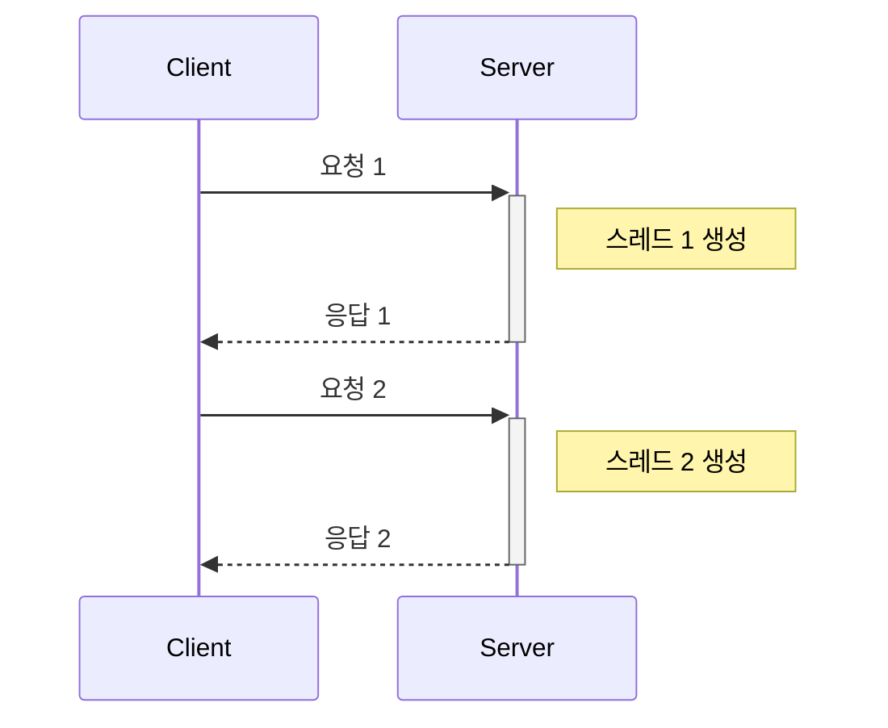
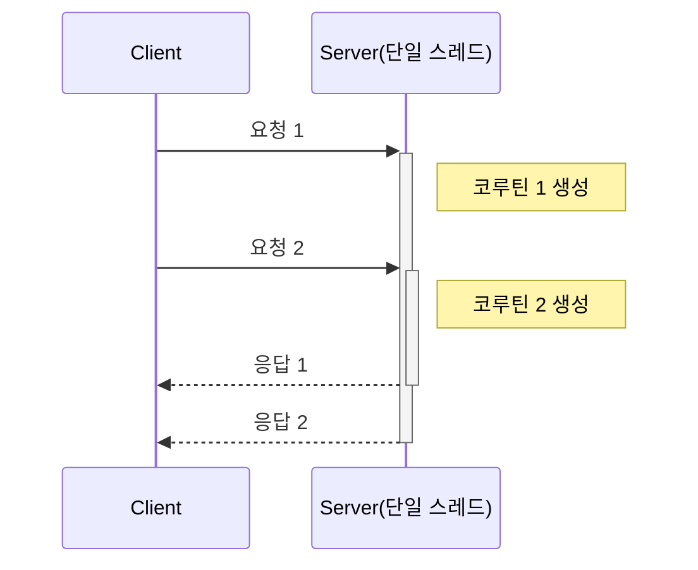

{: .align-center}

<br>

# FastAPI

> - FastAPI는 동기와 비동기 방식을 모두 지원합니다
> - 동기 방식은 요청당 새로운 스레드를 생성합니다
> - 비동기 방식은 단일 스레드에서 코루틴으로 처리합니다
> - 비동기 함수에서 동기 작업 사용 시 성능 저하가 발생할 수 있습니다

## 1. 동기식 (sync) 처리 방식

전통적인 WSGI (Web Server Gateway Interface) 프레임워크의 처리 방식으로, **요청 하나당 스레드 하나를 생성**하여 처리합니다.

{: .align-center}



### 동기식 처리의 특징

- ✅ 구현이 직관적이고 단순함
- ✅ 각 요청이 독립적으로 처리됨
- ❌ 많은 동시 요청 시 메모리 사용량 증가
- ❌ 스레드 생성/제거 오버헤드 발생

## 2. 비동기식 (async) 처리 방식

단일 스레드에서 여러 코루틴을 활용하여 동시에 여러 요청을 처리합니다.

{: .align-center}



### 비동기식 처리의 특징
- ✅ 효율적인 리소스 사용
- ✅ 높은 동시성 처리 가능
- ❌ 코드 복잡도 증가
- ❌ 동기 함수 사용 시 성능 저하

## FastAPI 동작 방식

FastAPI 비동기 프레임워크로 웹 서버를 기동하기 위해서는 **ASGI (Async Server Gateway Interface)**가 필요하다.<br>
**uvicorn** 패키지를 기본적으로 제공하는데 그 외에 hypercorn, daphne 등을 활용하여 대체 가능하다.

전통적인 방식의 WSGI (Web Server Gateway Interface)와 같이 1개의 요청당 1개의 Thread를 생성하여 기동하는 웹 서버 방식과 다르게 uvicorn은 하나의 Thread에서 여러 코루틴 이벤트를 동시적으로 생성되고 동작한다.

## FastAPI sync vs async

FastAPi 공식문서의 [동시성과 async / await 페이지](https://fastapi.tiangolo.com/ko/async/)를 읽어보면 아래와 같이 언급되어 있다.<br>
동기(sync), 비동기(async) 두가지 방식을 다 지원하고 있으며 방식에 따라 동작 방식이 달라진다고 한다.

> 만약 당신의 응용프로그램이 (어째서인지) 다른 무엇과 의사소통하고 그것이 응답하기를 기다릴 필요가 없다면 async def를 사용하십시오. 모르겠다면, 그냥 def를 사용하십시오.
>
> [매우 세부적인 기술적 사항] 경로 작동 함수를 async def 대신 일반적인 def로 선언하는 경우, (서버를 차단하는 것처럼) 그것을 직접 호출하는 대신 대기중인 외부 스레드풀에서 실행됩니다.

이 말은 비동기 프레임워크라고해서 동기 처리를 못하는 것은 아니다. 단, 권장하는 비동기(async)을 사용할 때 FastAPI 이점을 최대한 활용하는 방식이기 때문에 추천하지 않을 뿐이다. **그리고 애매하면 async를 사용하지 말라는 말까지 적혀있다.** 그만큼 비동기에 대한 지식이 어느 정도 필요하다는 말이다.

# 실험

## 실험 목표

- 과연 동기 라우터일 경우는 멀티 스레드이고 비동기 라우터일 경우는 단일 스레드로 동작할까?
- 비동기 라우터에서 동기처리 함수가 있으면 bloacking이 될까?

## 실험 설계

```python
실험 조건:
- 동시 요청 수: 10개
- 테스트 대상: 동기 라우터 vs 비동기 라우터
- 특수 조건: 5번째 요청에서 sleep 처리
- 측정 지표: 스레드 ID, 응답 시간
```

## 실험 코드

### 1. FstAPI 기동

`main.py`를 작성하여 다음과 같이 동기/비동기 라우터 한개씩 만들어보자

```python
import time
import threading

import uvicorn
from fastapi.responses import JSONResponse
from fastapi import FastAPI
import datetime

sync_cnt = 0
async_cnt = 0

app = FastAPI()

@app.get(path="/sync")
def sync_example():
    global sync_cnt
    sync_cnt += 1
    thread_id = threading.get_ident()
    request_time = datetime.datetime.now().strftime("%Y-%m-%d %H:%M:%S")
    print(">>> sync_cnt: {}, request_time: {}".format(sync_cnt, request_time))
    if sync_cnt == 5:
        time.sleep(20)
        return JSONResponse({"message": "sync example (sleep)", "thread_id": thread_id, "request_time": request_time})
    return JSONResponse({"message": "sync example", "thread_id": thread_id, "request_time": request_time})


@app.get(path="/async")
async def async_example():
    global async_cnt
    async_cnt += 1
    thread_id = threading.get_ident()
    request_time = datetime.datetime.now().strftime("%Y-%m-%d %H:%M:%S")
    print(">>> async_cnt: {}, request_time:{}".format(async_cnt, request_time))
    if async_cnt == 5:
        time.sleep(20)
        return JSONResponse({"message": "async example (sleep)", "thread_id": thread_id, "request_time": request_time})
    return JSONResponse({"message": "async example", "thread_id": thread_id, "request_time": request_time})


if __name__ == "__main__":
    uvicorn.run("main:app", port=8000)
```

그 다음에 FastAPI를 uvicorn을 활용하여 다음과 같이 기동을 한다.

```bash
uvicorn main:app --port=8000
```

### 2. Client 테스트 코드 작성

Client 테스트 코드를 다음과 같이 작성하고 호출해보자

**동기 라우터 호출**

```python
import asyncio
import httpx

async with httpx.AsyncClient() as client:
    tasks = []
    for _ in range(10):  
        task = client.get("http://localhost:8000/sync", timeout=60)
        tasks.append(task)        
    responses = await asyncio.gather(*tasks)    
    for response in responses:
        print(response.json())
```

**비동기 라우터 호출**

```python
import asyncio
import httpx

async with httpx.AsyncClient() as client:
    tasks = []
    for _ in range(10):  
        task = client.get("http://localhost:8000/async", timeout=60)
        tasks.append(task)        
    responses = await asyncio.gather(*tasks)    
    for response in responses:
        print(response.json())
```

## 실험 결과

동기 라우터일 경우 response 메세지에서 thread_id를 확인해보면 **요청당 새로운 스레드가 생성**된다는 것을 알 수 있으며 request_time을 보면 멀티 스레드로 동작하기 때문에 **blocking 되지 않고 요청을 받을 수 있는 것**을 확인할 수 있다.

```bash
{'message': 'sync example', 'thread_id': 24256, 'request_time': '2024-11-26 13:05:37'}
{'message': 'sync example', 'thread_id': 12956, 'request_time': '2024-11-26 13:05:37'}
{'message': 'sync example', 'thread_id': 21444, 'request_time': '2024-11-26 13:05:37'}
{'message': 'sync example', 'thread_id': 17780, 'request_time': '2024-11-26 13:05:37'}
{'message': 'sync example', 'thread_id': 36956, 'request_time': '2024-11-26 13:05:37'}
{'message': 'sync example', 'thread_id': 12956, 'request_time': '2024-11-26 13:05:37'}
{'message': 'sync example (sleep)', 'thread_id': 24256, 'request_time': '2024-11-26 13:05:37'}
{'message': 'sync example', 'thread_id': 11476, 'request_time': '2024-11-26 13:05:37'}
{'message': 'sync example', 'thread_id': 4624, 'request_time': '2024-11-26 13:05:37'}
{'message': 'sync example', 'thread_id': 6548, 'request_time': '2024-11-26 13:05:37'}
```

FastAPI 프레임워크에서 출력한 메세지이다. request_time을 보면 blocking 없이 동일한 시간에 요청을 받았다는 것을 확인할 수 있다.

```bash
>>> sync_cnt: 1, request_time: 2024-11-26 13:05:37
>>> sync_cnt: 2, request_time: 2024-11-26 13:05:37
>>> sync_cnt: 3, request_time: 2024-11-26 13:05:37
>>> sync_cnt: 4, request_time: 2024-11-26 13:05:37
>>> sync_cnt: 5, request_time: 2024-11-26 13:05:37
>>> sync_cnt: 7, request_time: 2024-11-26 13:05:37
>>> sync_cnt: 6, request_time: 2024-11-26 13:05:37
>>> sync_cnt: 8, request_time: 2024-11-26 13:05:37
>>> sync_cnt: 9, request_time: 2024-11-26 13:05:37
>>> sync_cnt: 10, request_time: 2024-11-26 13:05:37

INFO:     127.0.0.1:51919 - "GET /sync HTTP/1.1" 200 OK
INFO:     127.0.0.1:51920 - "GET /sync HTTP/1.1" 200 OK
INFO:     127.0.0.1:51925 - "GET /sync HTTP/1.1" 200 OK
INFO:     127.0.0.1:51921 - "GET /sync HTTP/1.1" 200 OK
INFO:     127.0.0.1:51922 - "GET /sync HTTP/1.1" 200 OK
INFO:     127.0.0.1:51924 - "GET /sync HTTP/1.1" 200 OK
INFO:     127.0.0.1:51923 - "GET /sync HTTP/1.1" 200 OK
INFO:     127.0.0.1:51926 - "GET /sync HTTP/1.1" 200 OK
INFO:     127.0.0.1:51928 - "GET /sync HTTP/1.1" 200 OK
```

비동기 라우터일 경우 response 메세지에서 thread_id를 확인해보면 **요청 전부가 단일 스레드에서 처리된다는 것**을 알 수 있다.

```bash
>>> async_cnt: 1, request_time:2024-11-26 13:07:16
INFO:     127.0.0.1:51959 - "GET /async HTTP/1.1" 200 OK
>>> async_cnt: 2, request_time:2024-11-26 13:07:16
INFO:     127.0.0.1:51961 - "GET /async HTTP/1.1" 200 OK
>>> async_cnt: 3, request_time:2024-11-26 13:07:16
INFO:     127.0.0.1:51962 - "GET /async HTTP/1.1" 200 OK
>>> async_cnt: 4, request_time:2024-11-26 13:07:16
INFO:     127.0.0.1:51960 - "GET /async HTTP/1.1" 200 OK
>>> async_cnt: 5, request_time:2024-11-26 13:07:16
INFO:     127.0.0.1:51963 - "GET /async HTTP/1.1" 200 OK
>>> async_cnt: 6, request_time:2024-11-26 13:07:36
INFO:     127.0.0.1:51964 - "GET /async HTTP/1.1" 200 OK
>>> async_cnt: 7, request_time:2024-11-26 13:07:36
INFO:     127.0.0.1:51966 - "GET /async HTTP/1.1" 200 OK
>>> async_cnt: 8, request_time:2024-11-26 13:07:36
INFO:     127.0.0.1:51968 - "GET /async HTTP/1.1" 200 OK
>>> async_cnt: 9, request_time:2024-11-26 13:07:36
INFO:     127.0.0.1:51965 - "GET /async HTTP/1.1" 200 OK
>>> async_cnt: 10, request_time:2024-11-26 13:07:36
INFO:     127.0.0.1:51967 - "GET /async HTTP/1.1" 200 OK
```

```bash
{'message': 'async example', 'thread_id': 16084, 'request_time': '2024-11-26 13:07:16'}
{'message': 'async example', 'thread_id': 16084, 'request_time': '2024-11-26 13:07:16'}
{'message': 'async example', 'thread_id': 16084, 'request_time': '2024-11-26 13:07:36'}
{'message': 'async example', 'thread_id': 16084, 'request_time': '2024-11-26 13:07:16'}
{'message': 'async example', 'thread_id': 16084, 'request_time': '2024-11-26 13:07:16'}
{'message': 'async example', 'thread_id': 16084, 'request_time': '2024-11-26 13:07:36'}
{'message': 'async example', 'thread_id': 16084, 'request_time': '2024-11-26 13:07:36'}
{'message': 'async example', 'thread_id': 16084, 'request_time': '2024-11-26 13:07:36'}
{'message': 'async example (sleep)', 'thread_id': 16084, 'request_time': '2024-11-26 13:07:16'}
{'message': 'async example', 'thread_id': 16084, 'request_time': '2024-11-26 13:07:36'}
```

## 주의사항 및 팁
1. 비동기 함수에서는 반드시 비동기 라이브러리 사용하기
   ```python
   # 좋은 예
   await asyncio.sleep(1)
   
   # 나쁜 예
   time.sleep(1)  # 전체 이벤트 루프 블로킹!
   ```

2. 데이터베이스 작업 시 비동기 드라이버 활용
   ```python
   # 좋은 예
   from databases import Database
   
   # 나쁜 예
   import sqlite3  # 동기식 드라이버
   ```

3. 외부 API 호출 시 비동기 클라이언트 사용
   ```python
   # 좋은 예
   async with httpx.AsyncClient() as client:
       response = await client.get(url)
   
   # 나쁜 예
   requests.get(url)  # 동기식 호출
   ```

## 결론

- FastAPI 동기 라우터일 경우 요청당 새로운 스레드를 생성하여 처리한다.
- FastAPI 비동기 라우터일 경우 단일 스레드이며 코루틴으로 처리한다.
- 비동기 라우터 안의 동기 함수처리가 포함되어 있을 경우 현재 요청이 끝날때까지 Blocking 처리된다.
  
---

- FastAPI 비동기 라우터에서는 세심한 주의를 기울여야한다.
- 프로세스상 requests, sleep 같은 동기 함수 처리나 패키지가 있는지 살펴봐야할 것이며 이로 인하여 request 요청을 받지 못하거나 딜레이되는 치명적인 실수를 범할 수 있다. 


## References

- [FastAPI 공식 문서 - 동시성과 async/await](https://fastapi.tiangolo.com/ko/async/)
- [Python 공식 문서 - asyncio](https://docs.python.org/ko/3/library/asyncio.html)
- [ASGI 명세](https://asgi.readthedocs.io/en/latest/)
